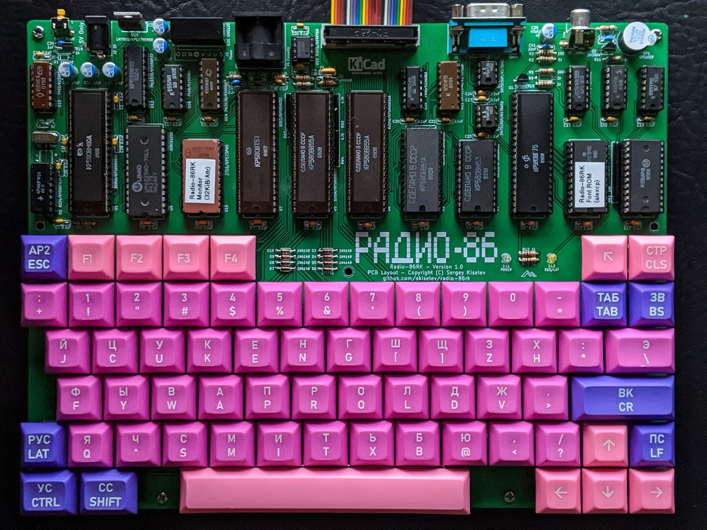

# Radio 86RK
Re-make of the Soviet Ham Radio computer published in Radio Magazine in 1986

## Hardware Documentation

## Table of Content
* [Introduction](#introduction)
* [Specifications](#specifications)
* [Hardware Documentation](#hardware-documentation)
  * [Schematic and PCB Layout](#schematic-and-pcb-layout)
  * [Connectors](#connectors)
  * [Bill of Materials](#bill-of-materials)
  * [Memory Map](#memory-map)
* [Firmware Documentation](#firmware-documentation)
  * [Monitor](#monitor)
* [Release Notes](#release-notes)
  * [Changes](#changes)
  * [Known Issues](#known-issues)

## Introduction
This project is a remake of [Radio-86RK](https://en.wikipedia.org/wiki/Radio-86RK) - a soviet ham radio computer. The original design was published in Radio Magazine, an amateur radio and DIY electronics oriented publication, starting from [April 1986](http://archive.radio.ru/web/1986/04/027/). Hence the "Radio" and "86" in the name ("RK" stands for ham radio computer).

The goal of the original design was to create a computer that can be built relatively easily and cheaply using commonly available components. Therefore it included several short-cuts. For example it didn't use 8228 bus controller. Instead, it uses */WR* and *DBIN* CPU signals instead to distinguish between write and read CPU cycles. Since the system doesn't decode I/O control signals, all the I/O devices are memory mapped. Another optimization is the use of DMA controller for both supplying the data to the CRT controller and for refreshing DRAMs. The system didn't support interrupts. The sound was implemented using *INTE* output of the CPU. The software would use **EI**/**DI** instructions to generate sound. There are no graphics capabilities. The font size was limited to 128 characters (8275 CRT controller limitation), and given that it had to support both Latin and Cyrillic ABCs, it only had capital letters for both ABCs. The CRT controller shares 16 MHz clock oscillator with the CPU (not uncommon in other home computers at that time period).

Despite the limitations, the design was fairly successful, many people have built this computer, and there are some that still building one, this project included. In addtion, several factories manufactured computers based on (but not always compatible with) this design - e.g. [Mikrosha](https://oldcomputer.info/8bit/mikrosha/index.htm), [Apogee BK-01](https://ru.wikipedia.org/wiki/%D0%90%D0%BF%D0%BE%D0%B3%D0%B5%D0%B9_%D0%91%D0%9A-01), and a few more.

### Specifications of the Original Design
  * KR580VM80A (Intel 8080) CPU @ 1.78 MHz (16 MHz divided by 9)
  * 16 KiB to 32 KiB DRAM, 2 KiB ROM (monitor software)
  * KR580VG75 (Intel 8275) CRT controller which works together with KR580VT57 (Intel 8257) DMA controller. 1 KiB ROM is used for font
  * Two KR580VV55A (Intel 8255A) PPIs. One is used for keyboard and cassette I/O, another one for the extension port
  * Normally the computer consisted of 2 or 3 PCBs - the mainboard, the keyboard, and the keypad.

### Modifications to the Original Design
 * 16 DRAM ICs replaced with a single 32 KiB SRAM IC
 * Font ROM size increased to 2 KiB, so that it fits an alternative font. CRT controller GPA0 attribute is used to switch between fonts.
 * Reverse video attribute implemented in CRT controller
 * Added 8251 USART and 8253 timer. The timer is used for dividing the clock for USART and for sound generation.
 * Single board design, including an integrated mechanical keyboard
 * The work is largely based on [Radio-86RК-SRAM](http://radio86rk.pbworks.com/w/page/58467718/Radio-86R%D0%9A-SRAM) project created by Alexey Khudyakov (alexcp).

## Specifications
* Processor: Intel 8080A / КР580ВМ80А CPU running at 1.78 MHz
* Memory:
  * RAM: 32 KiB SRAM
  * ROM: 2 KiB UV EPROM with system monitor software
* Video: Intel 8275 / КР580ВГ75 CRT Controller
  * Alphanumeric display
  * 2 KiB UV EPROM with font
  * Composite video output (50 Hz)
* Audio:
  * Intel 8253 / КР580ВИ53 (single channel)
  * CPU INTE output
* Parallel Interface:
  * Intel 8255А / КР580ВВ55А PPI
  * 26-pin expansion header
* Serial Interface:
  * Intel 8251А / КР580ВВ51А USART
  * DE-9 connector
* Built-in 67-keys keyboard
* Cassette recorder interface

## Hardware Documentation

### Schematic and PCB Layout

[Schematic - Version 1.3](KiCad/Radio-86RK-Schematic-1.3.pdf)

[PCB Layout - Version 1.3](KiCad/Radio-86RK-Board-1.3.pdf)

### Connectors

#### J1 - Composite Video

Pin | Description     
--- | ---------------
Tip (the inner contact) | Output: Composite Video
Ring / Sleeve         |	Power: GND

#### J2 - Power (5V)
Connect regulated +5V power supply to this connector.

Note: The 8080A CPU, clock generator, and serial port transmitters and receivers use +12V/-5V/-12V voltages. An on-board DC-DC converter (U26) is used to obtain these voltages. Instead of using the DC-DC converter it is possible to provide these voltages directly to the system using J3 connector.

Pin | Description     
--- | ---------------
Tip (the inner contact) | Power: 5V (positive terminal)
Barrel / Sleeve         |	Power: GND (negative terminal)

#### J3 - Power (5V, 12V, -12V)
Connect regulated 5V/12V/-12V power supply to this connector.

Pin | Description     
--- | ---------------
1, 2, 3 | Power: GND
4, 5, 6 |	Power: 5V
7   |	Power: 12V
8   |	Power: -12V

#### J4 - Cassette Connector
Pin | Description     
--- | ---------------
1, 2, 3, 8   | Power: GND
4   |	Output: Sound output to cassette recorder (line level)
5   |	Input: Sound input from cassette recorder (line level)
6, 7 |	Not connected

#### J5 - Serial Port Connector
Pin | Description     
--- | ---------------
1   | Not connected: DCD
2   | Input: RX
3   | Output: TX
4   | Output: DTR
5   | Power: GND
6   | Input: DSR
7   | Output: RTS
8   | Input: CTS
9   | Not connected: RI

#### J6 - Parallel Port Connector
Pin | Description | Pin | Description
--- | ----------- | --- | ----------------
1   | Output: PC0 | 2   | Input: PA0
3   | Output: PC1 | 4   | Input: PA1
5   | Output: PC2 | 6   | Input: PA2
7   | Output: PC3 | 8   | Input: PA3
9   | Output: PC4 | 10  | Input: PA4
11  | Output: PC5 | 12  | Input: PA5
13  | Output: PC6 | 14  | Input: PA6
15  | Output: PC7 | 16  | Input: PA7
17  | Output: PB7 | 18  | Output: PB0
19  | Output: PB6 | 20  | Output: PB1
21  | Output: PB5 | 22  | Output: PB2
23  | Output: PB4 | 24  | Output: PB3
25  | Power: +5V  | 26  | Power: GND

### Bill of Materials

[Radio-86RK project on Mouser.com](https://www.mouser.com/ProjectManager/ProjectDetail.aspx?AccessID=d3d8f92a02) - View and order all components except of the PCB, and most Intel 8xxx ICs.

Component type     | Reference | Description                                 | Quantity | Possible sources and notes
------------------ | --------- | ------------------------------------------- | -------- | --------------------------
PCB                |           | Radio-86RK PCB - Version 1.2                | 1        | Buy from my Tindie store: [Radio-86RK - PCB](https://www.tindie.com/products/weird/radio-86rk-pcb/) or order from a PCB manufacturer of your choice using provided Gerber or KiCad files
Capacitor          | C1 - C32  | 0.1 uF, MLCC, 5 mm Pitch                    | 32       | Mouser [594-K104K15X7RF53H5](https://www.mouser.com/ProductDetail/594-K104K15X7RF53H5)
Capacitor          | C33 - C38 | 47 uF, Electrolytic                         | 6 	      | Mouser [80-A750EK476M1EAAE40](https://www.mouser.com/ProductDetail/80-A750EK476M1EAAE40)
Capacitor          | C39       | 0.22 uF, MLCC, 5 mm Pitch                   | 1        | Mouser [810-FG24X7R1H224KNT0](https://www.mouser.com/ProductDetail/810-FG24X7R1H224KNT0)
Capacitor          | C40       | 22 nF, MLCC, 5 mm Pitch                     | 1        | Mouser [810-FG28X7R1H223KNT0](https://www.mouser.com/ProductDetail/810-FG28X7R1H223KNT0)
Capacitor          | C41       | 10 nF, MLCC, 5 mm Pitch                     | 1        | Mouser [810-FG28X7R1H103KNT0](https://www.mouser.com/ProductDetail/810-FG28X7R1H103KNT0)
Capacitor          | C42       | 2.2 nF, MLCC, 5 mm Pitch                    | 1        | Mouser [810-FG28X7R1H222KNT0](https://www.mouser.com/ProductDetail/810-FG28X7R1H222KNT0)
Capacitor          | C43       | 1 nF, MLCC, 5 mm Pitch                      | 1        | Mouser [810-FG28C0G1H102JNT6](https://www.mouser.com/ProductDetail/810-FG28C0G1H102JNT6)
Capacitor          | C44       | 10 pF, MLCC, 5 mm Pitch                     | 1        | Mouser [810-FG28C0G1H100DNT00](https://www.mouser.com/ProductDetail/810-FG28C0G1H100DNT0)
Diode              | D1 - D9  | 1N4148                                       | 9        | Mouser [512-1N4148](https://www.mouser.com/ProductDetail/512-1N4148)
LED                | D10       | LED Indicator, 3 mm, Green                  | 1        | Mouser [593-VAOL-3HDE4](https://www.mouser.com/ProductDetail/593-VAOL-3HDE4)
LED                | D11       | LED Indicator, 3 mm, Yellow                 | 1        | Mouser [593-VAOL-3HCE4](https://www.mouser.com/ProductDetail/593-VAOL-3HCE4)
Polyfuse           | F1        | 1.1A, 5 mm Pitch                            | 1        | Mouser [576-16R110BU](https://www.mouser.com/ProductDetail/576-16R110BU)
Connector          | J1        | RCA Phono connector, Yellow                 | 1        | Mouser [490-RCJ-014](https://www.mouser.com/ProductDetail/490-RCJ-014)
Connector          | J2        | DC Power Jack, 2mm                          | 1        | Mouser [806-KLDX-0202-A](https://www.mouser.com/ProductDetail/806-KLDX-0202-A)
Connector          | J3        | 8 pin friction lock connector               | 1        | Mouser [571-6404568](https://www.mouser.com/ProductDetail/571-6404568)
Connector          | J4        | DIN 8-pos, Right Angle, PCB mount           | 1        | Mouser [490-SDF-80J](https://www.mouser.com/ProductDetail/490-SDF-80J)
Connector          | J5        | Sub-D DE9M, Right Angle, PCB mount          | 1        | Mouser [523-L717SDE09P1ACH3R](https://www.mouser.com/ProductDetail/523-L717SDE09P1ACH3R)
Connector          | J6        | 13x2 pin header, shrouded                   | 1        | Mouser [517-30326-6002](https://www.mouser.com/ProductDetail/517-30326-6002)
Transistor         | Q1, Q2    | 2N3904                                      | 2        | Mouser [512-2N3904TA](https://www.mouser.com/ProductDetail/512-2N3904TA)
Resistor           | R1        | 33 ohm                                      | 1        | Mouser [291-33-RC](https://www.mouser.com/ProductDetail/291-33-RC)
Resistor           | R2        | 75 ohm                                      | 1        | Mouser [291-75-RC](https://www.mouser.com/ProductDetail/291-75-RC)
Resistor           | R3        | 150 ohm                                     | 1        | Mouser [291-150-RC](https://www.mouser.com/ProductDetail/291-150-RC)
Resistor           | R4        | 330 ohm                                     | 1        | Mouser [291-330-RC](https://www.mouser.com/ProductDetail/291-330-RC)
Resistor           | R5        | 1.5 k                                       | 1        | Mouser [291-1.5K-RC](https://www.mouser.com/ProductDetail/291-1.5K-RC)
Resistor           | R6 - R13  | 1 k                                         | 8        | Mouser [291-1K-RC](https://www.mouser.com/ProductDetail/291-1K-RC)
Resistor           | R14       | 2.4 k                                       | 1        | Mouser [291-2.4K-RC](https://www.mouser.com/ProductDetail/291-2.4K-RC)
Resistor           | R15       | 12 k                                        | 1        | Mouser [291-12K-RC](https://www.mouser.com/ProductDetail/291-12K-RC)
Resistor Array     | RN1       | 10 k, SIP10                                 | 1        | Mouser [266-10K-RC](https://www.mouser.com/ProductDetail/266-10K-RC)
Resistor Array     | RN2 - RN4 | 4.7 k, SIP6                                 | 3        | Mouser [264-4.7K-RC](https://www.mouser.com/ProductDetail/264-4.7K-RC)
Speaker            | SP1       | 12 mm speaker                               | 1        | Mouser [665-AT-1224TWTR](https://www.mouser.com/ProductDetail/665-AT-1224TWTR)
Keyboard Switch    | SW1 - SW67 | Cherry MX Blue (Clicky)                    | 67       | Mouser [540-MX1A-E1NW](https://www.mouser.com/ProductDetail/540-MX1A-E1NW)
Switch Leveling Kit | SW11, SW64 | Leveling kit for MX 1x2, 1x2.25, 1x2.75   | 5        | Mouser [540-G99-0742](https://www.mouser.com/ProductDetail/540-G99-0742)
Switch Leveling Kit | SW64     | Leveling kit for MX 1x8                     | 1        | Mouser [540-G99-0226](https://www.mouser.com/ProductDetail/540-G99-0226) Note: Use one of 540-G99-0742 to build a through hole leveling kit for the spacebar

Tactile Switch     | SW68      | 6 mm Tactile Switch Right Angle             | 1        | Mouser [653-B3F-3152](https://www.mouser.com/ProductDetail/653-B3F-3152)
Switch Keycap      | SW68      | 4 x 4 mmm Tactile Switch Key Cap, Orange    | 1        | Mouser [653-B32-1020](https://www.mouser.com/ProductDetail/653-B32-1020)
Integrated Circuit | U1        | Intel 8080A / КР580ВМ80А, CPU               | 1        | Jameco [52046](https://www.jameco.com/z/8080A-Major-Brands-IC-8080A-8-Bit-MOS-MPU_52046.html)
Integrated Circuit | U2        | Intel 8224 / КР580ГФ24, Clock Generator     | 1        |
Integrated Circuit | U3        | Intel 8251А / КР580ВВ51А, USART             | 1        |
Integrated Circuit | U4        | Intel 8253 / КР580ВИ53, PIT                 | 1        | Mouser [968-CP82C54Z](https://www.mouser.com/ProductDetail/968-CP82C54Z)
Integrated Circuit | U5, U6    | Intel 8255А / КР580ВВ55А, PPI               | 2        | Mouser [968-CP82C55A-5Z](https://www.mouser.com/ProductDetail/968-CP82C55A-5Z), Jameco [52732](https://www.jameco.com/z/8255A-5-Major-Brands-IC-8255A-5-Programmable-Peripheral-Interface-40-pin-DIP_52732.html)
Integrated Circuit | U7        | Intel 8257 / КР580ВТ57, DMA Controller      | 1        |
Integrated Circuit | U8        | Intel 8275 / КР580ВГ75, CRT Controller      | 1        | Jameco [52821](https://www.jameco.com/z/8275-Major-Brands-Programmable-CRT-Controller-DIP-40_52821.html)
Integrated Circuit | U9        | AS6C62256, SRAM 32Kx8                       | 1        | Mouser [913-AS6C62256-55PCN](https://www.mouser.com/ProductDetail/913-AS6C62256-55PCN)
Integrated Circuit | U10, U11  | 2716 / КР573РФ5, 2Kx8 EPROM                 | 2        |
Integrated Circuit | U12       | 74LS373/К555ИР22, 8-bit Latch, 3-state outputs | 1     | Mouser [595-SN74LS373N](https://www.mouser.com/ProductDetail/595-SN74LS373N)
Integrated Circuit | U13       | 74198/К155ИР13, 8-bit Shift Register        | 1        |
Integrated Circuit | U14       | 74LS138/К555ИД7, Decoder 3 to 8 active low outputs | 1 | Mouser [595-SN74LS138N](https://www.mouser.com/ProductDetail/595-SN74LS138N)
Integrated Circuit | U15       | 7492/К155ИЕ4, Divide by 12 counter          | 1        | Mouser [595-SN74LS92N](https://www.mouser.com/ProductDetail/595-SN74LS92N)
Integrated Circuit | U16       | 7486/К155ЛП5, Quad 2-input XOR              | 1        | Mouser [595-SN74LS86AN](https://www.mouser.com/ProductDetail/595-SN74LS86AN)
Integrated Circuit | U17       | 7474/К155ТМ2, Dual D Flip-flop, Set & Reset | 1        | Mouser [595-SN74LS74AN](https://www.mouser.com/ProductDetail/595-SN74LS74AN)
Integrated Circuit | U18       | 7408/К155ЛИ1, Quad 2-input AND              | 1        | Mouser [595-SN74LS08N](https://www.mouser.com/ProductDetail/595-SN74LS08N)
Integrated Circuit | U19       | 7404/К155ЛН1, Hex Inverter                  | 1        | Mouser [595-SN74LS04N](https://www.mouser.com/ProductDetail/595-SN74LS04N)
Integrated Circuit | U20       | 7400/К155ЛА3, Quad 2-input NAND             | 1        | Mouser [595-SN74LS00N](https://www.mouser.com/ProductDetail/595-SN74LS00N)
Integrated Circuit | U21       | TL071/К140УД6, Operational Amplifier        | 1        | Mouser [595-TL071IP](https://www.mouser.com/ProductDetail/595-TL071IP)
Integrated Circuit | U22       | SN75154N/К170УП2В, Quad RS-232 Receiver     | 1        | Mouser [595-SN75154N](https://www.mouser.com/ProductDetail/595-SN75154N)
Integrated Circuit | U23, U24  | SN75150P/К170АП2, Dual RS-232 Driver        | 2        | Mouser [595-SN75150P](https://www.mouser.com/ProductDetail/595-SN75150P)
Integrated Circuit | U25       | LM7905/КР1179ЕНВ, Negative 5V 1A Linear Regulator | 1  | Mouser [926-LM7905CT-NOPB](https://www.mouser.com/ProductDetail/926-LM7905CT-NOPB)
DC-DC Converter    | U26       | IZ0512, +/-12V +/-125mA, 4.5V-9V input      | 1        | Mouser [209-IZ0512S](https://www.mouser.com/ProductDetail/209-IZ0512S)
Integrated Circuit | U27       | DS1233-5, CPU Supervisory Circuit           | 1        | Mouser [700-DS1233-5T&R](https://www.mouser.com/ProductDetail/700-DS1233-5TR)
Crystal            | Y1        | 16 MHz, Series, HC-49U                      | 1        | Mouser [774-ATS160-E](https://www.mouser.com/ProductDetail/774-ATS160-E)
IC Socket          | U1, U5, U6, U7, U8 | 40 pin DIP                         | 5        | Mouser [517-4840-6000-CP](https://www.mouser.com/ProductDetail/517-4840-6000-CP)
IC Socket          | U3, U9    | 28 pin DIP                                  | 2        | Mouser [517-4828-6000-CP](https://www.mouser.com/ProductDetail/517-4828-6000-CP)
IC Socket          | U4, U10, U11, U13 | 24 pin DIP                          | 4        | Mouser [517-4824-6000-CP](https://www.mouser.com/ProductDetail/517-4824-6000-CP)
IC Socket          | U12       | 20 pin DIP                                  | 1        | Mouser [517-4820-3000-CP](https://www.mouser.com/ProductDetail/517-4820-3000-CP)
IC Socket          | U2, U14, U22 | 16 pin DIP                               | 3        | Mouser [517-4816-3000-CP](https://www.mouser.com/ProductDetail/517-4816-3000-CP)
IC Socket          | U15 - U20 | 14 pin DIP                                  | 5        | Mouser [517-4814-3000-CP](https://www.mouser.com/ProductDetail/517-4814-3000-CP)
IC Socket          | U21, U23, U24 | 8 pin DIP                               | 3        | Mouser [517-4808-3000-CP](https://www.mouser.com/ProductDetail/517-4808-3000-CP)

### Memory Map
* 0000h - 7FFFh - SRAM
  * 7600h - 7FFFh - Display buffer and monitor variables
* 8000h - 8FFFh - 8255A PPI (Keyboard, Cassette recorder, Sound control)
  * 8000h - Channel A data
  * 8001h - Channel B data
  * 8002h - Channel C data
  * 8003h - Control word
* 9000h - 9FFFh - 8253 Timer (USART Clock, Sound)
  * 9000h - Channel 0 count
  * 9001h - Channel 1 count
  * 9002h - Channel 2 count
  * 9003h - Control word
* 0A000h - 0AFFFh - 8255A PPI (Parallel Interface)
  * 0A000h - Channel A data
  * 0A001h - Channel B data
  * 0A002h - Channel C data
  * 0A003h - Control word
* 0B000h - 0BFFFh - 8251A USART
  * 0B000h - Data register
  * 0B001h - Command register
* 0C000h - 0CFFFh - 8275 CRT Controller
* 0D000h - 0DFFFh - Unused
* 0E000h - 0EFFFh - 8257 DMA Controller (write only)
* 0E000h - 0FFFFh - Monitor EPROM (read only)

## Firmware Documentation

### Monitor

#### Monitor Commands
* Memory Operations
  * **D\<Start_Address\>,\<End_Address\>** - Display memory content in hexadecimal
  * **L\<Start_Address\>,\<End_Address\>** - Display memory content in ASCII
  * **F\<Start_Address\>,\<End_Address\>,\<Value\>** - Fill memory with the specified value
  * **M\<Address\>** - Modify memory content
  * **T\<Start_Address\>,\<End_Address\>,\<Destination_Start_Address\>** - Copy memory block to destination
  * **C\<Start_Address\>,\<End_Address\>,\<Destination_Start_Address\>** - Compare memory block with destination
  * **S\<Start_Address\>,\<End_Address\>,\<Value\>** - Search memory for a value
  * **R\<ROM_Start_Address\>,\<ROM_End_Address\>,\<Destination_Start_Address\>** - Read from the ROM connected to the Parallel interface to memory
* Run Control
  * **G\<Start_Address\>\[,End_Address\]** - Run code, optionally stop at the specified address
  * **X** - Display and modify registers
* Cassette Input/Output
  * **O\<Start_Address\>,\<End_Address\>\[,Speed\]** - Write memory to cassette. Default speed is 1Dh / 1200 bps
  * **I\[Offset\]\[,Speed\]** - Read data from to cassette memory at specified offset

#### Monitor Subroutines:
* 0F803h - Keyboard input
  * Input: None
  * Output: A - character code read from keyboard
* 0F806h - Cassette input
  * Input: A=0FFh - with sync; A=08h - no sync
  * Output: A - data read from cassette
* 0F809h - Print character to screen
  * Input: C - character to print
* 0F80Ch - Cassette output
  * Input: C - data to write
* 0F812h - Query keyboard
  * Output: A=00h - key not pressed; A=0FFh - key pressed
* 0F815h - Print to screen in hex
  * Input: A - data to print
* 0F818h - Print string
  * Input: HL - string address
* 0F81Bh - Get key
  * Output: A=0FFh - key not pressed; A=0FEh - Rus/Lat; otherwise A - key code
* 0F81Eh - Get cursor position
  * Output: H - row, L - column
* 0F821h - Read character from screen at current cursor position
  * Output: A - char read from screen
* 0F824h - Read from cassette
  * Input: HL - offset of memory buffer to store data to
  * Output: HL - start; DE - end; BC - checksum

## Release Notes

### Changes
* Version 1.3
  * Fix issues from version 1.1 and version 1.2:
    * Use key labels "Ь X" and "СС SHIFT" on top silkscreen
    * Video signal generation circuit: use R2 = 75 Ohm and R5 = 1.5 kOhm
    
* Version 1.2
  * Add F5 key
  * Add copyright year on the top silkscreen

* Version 1.1
  * Fix all known issues of version 1.0
  * Use DS1233-5 mircoprocessor supervisor to generate reset signal
  * Implement reverse video attribute

* Version 1.0
  * Initial version

### Known Issues
* Version 1.3
  * No known issues

* Version 1.2
  * Top silkscreen: "Ь" and "X" key labels are swapped
  * Top silkscreen: More correct translation for "СС" is "SHIFT"
  * Video signal generation: Produced video Vpp and the backporch levels are a bit too high. Use R2 = 75 to 100 Ohm, and R5 = 1.5 kOhm for proper video signal levels (Reported by Martin Lukasek)
* Version 1.1
  * Top silkscreen: "Ь" and "X" key labels are swapped
  * Top silkscreen: More correct translation for "СС" is "SHIFT"
  * Top silkscreen: No copyright year
  * Video signal generation: Produced video Vpp and the backporch levels are a bit too high. Use R2 = 75 to 100 Ohm, and R5 = 1.5 kOhm for proper video signal levels (Reported by Martin Lukasek)

* Version 1.0
  * 8224 (U2) should use DIP-16 footprint
  * Down and Right buttons swapped
  * Reset RC does not provide enough time for the system to properly reset at power-on
